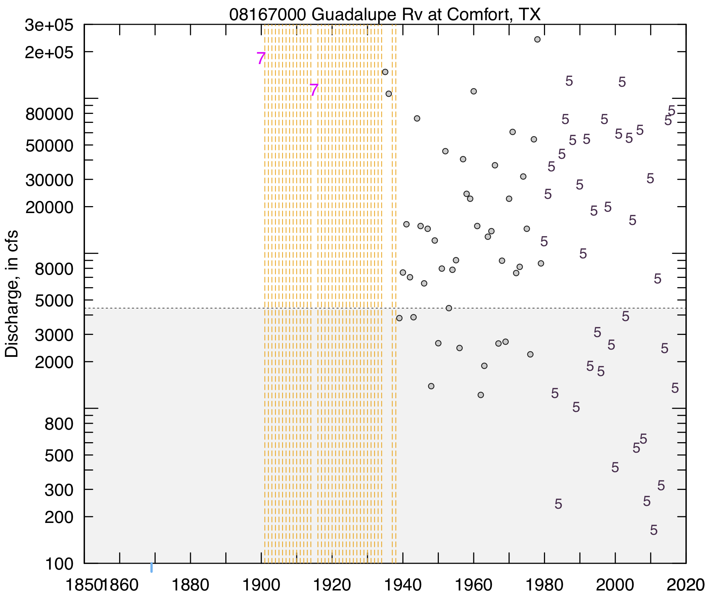
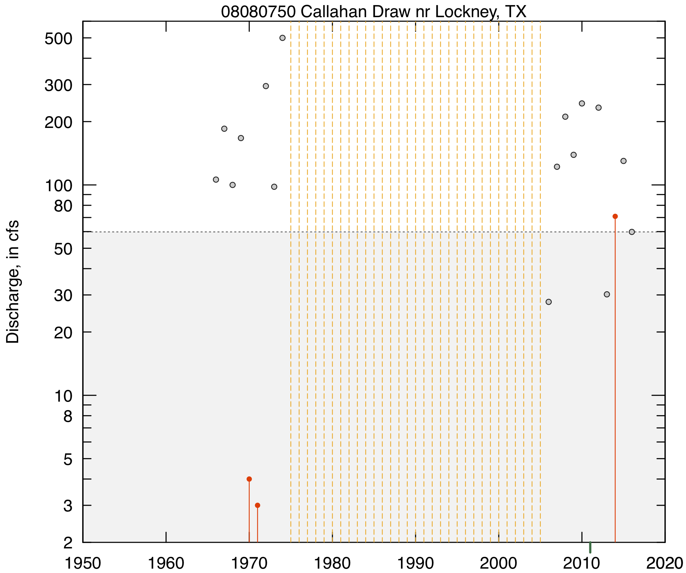

# MGBT---Multiple Grubbs-Beck Low-Outlier Test


#### Author:           William H. Asquith, John F. England
#### Contributor:      George R. Herrmann
#### Point of contact: William H. Asquith (wasquith@usgs.gov)
#### Repository Type:  Formal _R_ language package
#### Year of Origin:   2019 (original publication)
#### Year of Version:  2020
#### Version:          [1.0.4](https://code.usgs.gov/water/stats/MGBT/-/tags/v1.0.4)
#### Digital Object Identifier (DOI): https://doi.org/10.5066/P9CW9EF0
#### USGS Information Product Data System (IPDS) no.: IP-110307 (internal agency tracking)

***

_Suggested Citation:_

Asquith, W.H., England, J.F., and Herrmann, G.R. (contributor), 2020, MGBT---Multiple Grubbs-Beck low-outlier test: U.S. Geological Survey software release, R package, Reston, Va., https://doi.org/10.5066/P9CW9EF0.
[https://code.usgs.gov/water/stats/MGBT]
[https://CRAN.R-project.org/package=MGBT]

_Authors' [ORCID](https://orcid.org/) nos.:_
William H. Asquith, [0000-0002-7400-1861](https://orcid.org/0000-0002-7400-1861);
John F. England, [0000-0001-5563-6274](https://orcid.org/0000-0001-5563-6274);
George R. Herrmann, [0000-0003-3829-5580](https://orcid.org/0000-0003-3829-5580).

***
***

# DESCRIPTION

The multiple Grubbs-Beck low-outlier test on positively distributed data (with no negative values) is supported along, and utilities provided for noninterpretive U.S. Geological Survey (USGS) annual peak-streamflow data processing. USGS peak streamflow data are acquired from the National Water Information System ([NWIS](https://doi.org/10.5066/F7P55KJN)) (U.S. Geological Survey, 2019). Colloquially, such data are often referred to as coming from the "peak-flow file," and more details are found in Asquith and others (2017, app. 1). The **MGBT** package for the _R_ language (R Development Core Team, 2019) is approved as an official USGS software release (see `./inst/USGSapproval20190924.pdf`).

The package resides along the aforementioned digital object identifier (DOI) [link](https://doi.org/10.5066/P9CW9EF0) as well as the [Comprehensive R Archive Network (CRAN)](https://CRAN.R-project.org) with that package's [canonical link](https://CRAN.R-project.org/package=MGBT) shown also in the _Suggested Citation_. Please consult this README within the DOI link along with other files (`CONTRIBUTING.md`, `DISCLAIMER.md`, `LICENSE.md`) that either in nonstandard locations for the CRAN or are not pushed to the CRAN (the files matching `./inst/*.pdf`) to keep this package as light weight as possible and consistent with CRAN policies.

# PACKAGE INSTALLATION

## CRAN Release

To install the **MGBT** package, one must be using _R_ 3.0.0 or greater and run the following command for the [CRAN release](https://CRAN.R-project.org/package=MGBT) (suitable local configuration is assumed):
```{r}
  install.packages("MGBT")
```

## Package Homepage (Installation from Source)

To get inter-CRAN release updates, use one of the following example commands, which requires the **remotes** package to be installed:
```{r}
  library(remotes)
  # Option 1
  install_git("https://code.usgs.gov/water/stats/MGBT.git")

  # Option 2
  install_url("https://code.usgs.gov/water/stats/MGBT/-/archive/master/MGBT.zip")

  # Option 3
  # The next example appears to fail, further study is needed.
  install_gitlab("stats/MGBT", host="https://code.usgs.gov/water")
```

## Additional Notes on Package Installation from Sources

Attention to which TAR (unzipping software) is used to unpack compressed files (inflate the repository) is needed for some Windows operating system users. For example, on some Windows machines with Esri ArcGIS software installed, the `tar.exe` distributed with ArcGIS will automatically run, but that `tar.exe` does not provide for zip inflation. The error message will look like this:
```{r}
  C:\ArcGIS\gbin\tar.exe: Cannot use compressed or remote archives
  C:\ArcGIS\gbin\tar.exe: Error is not recoverable: exiting now
```
The easiest fix is to specify use of the `TAR="internal"` built into _R_ through the `Sys.setenv(TAR="internal")` command as shown above.

Alternatively, a so-called "tagged version number" of the **MGBT** can be downloaded from its DOI-linked website and installed from the local copy. Let us suppose that the **MGBT** tag "v1.0.0" has been downloaded and that the working directory in _R_ has been changed to the same directory holding the downloaded archive:
```{r}
  install.packages("MGBT-v1.0.4.tar.gz", repos=NULL, type="source")
  install.packages("MGBT-v1.0.4.tar.gz") # or possibly a command this short
```

Testing indicates that downloading other compressed archives, such as `MGBT-master.zip` or `MGBT-v1.0.4.zip`, does not always work across platforms tested (MacOS and Windows platforms). General attention to the `.tar.gz` format is recommended. Additional guidance on installation from sources (Windows platforms) can be found in the [file](https://code.usgs.gov/water/stats/MGBT/blob/master/inst/INSTALL_HELP.md)  `./inst/INSTALL_HELP.md` as well as in the **DETAILS** section below (non-Windows platforms).

# DETAILS

The **MGBT** package provides the Multiple Grubbs--Beck low-outlier test (MGBT) for use in analyzing streamflow statistics (Cohn and others, 2013, 2019; Lamontagne and Stedinger, 2015; Lamontagne and others, 2016). The `MGBT()` function explicitly wraps the recommended implementation of the test (England and others, 2018) for flood-frequency analysis. The package also serves as an archive of _R_ code related to the MGBT developed by the late Timothy A. Cohn, the primary researcher on the topic. This _R_ code was provided (Timothy A. Cohn, written commun., 2013, 2016) to the authors (Asquith and England) prior to porting the code into a formal _R_ package. Extensive auditing of the code was made at that time and throughout 2018. The MGBT implementation herein is believed through evidential testing to be a canonical match to that the MGBT implemented within the USGS _PeakFQ_ software (Veilleux and others, 2014; U.S. Geological Survey, 2018) if and only if the same data values are provided to the test.

The **MGBT** package also provides utility functions for noninterpretive processing of USGS peak streamflow data. These utilities include `makeWaterYear()` that adds the water year and parses the date-time stamp into useful subcomponents, `splitPeakCodes()` that splits the peak discharge qualification codes, and that `plotPeaks()` plots the peak time series with emphasis on visualization of select codes, zero flow values, and missing records (annual gaps). It is likely that this package contains the most sophisticated time series depiction yet written for the USGS peak-flow file.

The design of this package is to be compliant with the requirements of the [CRAN](https://CRAN.R-project.org). Standard idioms to the _R_ language are available for package compliance testing, installation, and user-manual building. The following commands can be used at the operating system console (at least on non-Windows platforms):
```{r}
  R CMD check --as-cran MGBT
  R CMD INSTALL MGBT
  R CMD Rd2pdf --force MGBT
  R CMD check --as-cran --run-donttest MGBT; # A more rigorous checking
  R CMD build MGBT # Example at version 1.0.4 and the .Rbuildignore is consulted.
  R CMD INSTALL MGBT_1.0.4.tar.gz
```

More details and background related to the **MGBT** package including its historical context, purpose, use, and demonstration of features are found within the user manual. In particular, the _R_ documentation file `man/MGBT-package.Rd` is the canonical starting point, and that starting point can be initiated after package installation through the following commands at the _R_ prompt:
```{r}
  library(MGBT)
  ?"MGBT-package"
```
A copy of the user manual built by `R CMD Rd2pdf` as shown previously and renamed is  [file](https://code.usgs.gov/water/stats/MGBT/blob/master/inst/doc/UserManual.pdf) `./inst/doc/UserManual.pdf` and is provided for convenience.

# EXAMPLES OF USE

## An example using a streamflow record that does not contain censored data

With an assumption that the USGS **dataRetrieval** package is installed, which is not an algorithmic dependency for the **MGBT** package, peak streamflows for a given streamflow-gaging station can be readily acquired, and the `MGBT()` demonstrated with plotting of the peak time series with the associated threshold determined by the MGBT. The time-series plot in sequel is produced by the following code in which the double-colon notation is used to emphasize what function is coming from where.
```{r}
  library(MGBT)
  library(dataRetrieval) # remember dataRetrieval is not needed to use MGBT()
  site <- "08167000"
  sf <- dataRetrieval::readNWISsite(site) # to get the station name
  pk <- dataRetrieval::readNWISpeak(site, convert=FALSE) # False is critical
  pk <- MGBT::splitPeakCodes(pk) # isolate discharge qualification codes
  pk <- pk[pk$water_yr <= 2017,] # at writing date only through 2017 peaks were available
  mgbt <- MGBT::MGBT(pk$peak_va[pk$appearsSystematic]) # compute the MGB test
  MGBT::plotPeaks(pk, lot=mgbt$LOThresh, ylab="Discharge, in cfs")
  mtext(paste0(sf$site_no," ",sf$station_nm))
```


The example graphic shows two historical peaks, several gaps in record, and that discharge qualification code 5 appears (see `splitPeakCodes()`) in the latter half of the record. The MGBT low-outlier threshold is depicted by the dashed line together with the grey shaded region. The use of the MGBT would appear to mitigate for an apparent inflation in the variation within the lower tail or so of the distribution of the peaks starting about 1980.

The potential graphical permutations of peak discharges, their codes, record gaps, historical peaks, historical gage height availability, censored data, and zero-flow years is complex. A comprehensive example of markup by the `plotPeaks()` function can be found in the portable document format (PDF) file located at `./inst/legend/legend_camera.pdf`. Users with deep interest in the USGS peak-flow file are likely quite interested in this function and the attendant description of the nomenclature.


## An example using a streamflow record containing censored data

Some subtle issues currently (2019) are known concerning the use of the MGBT with datasets containing censored data. For example, streamflow-gaging station 08080750 in Texas has three censored (less than values) and one zero flow year in its annual peak-streamflow record through the 2016 water year. The censored values are <3, <4, and <70.9 cubic feet per second (cfs). These three peaks have a _discharge qualification code of 4_ assigned to them within the USGS National Water Information System (NWIS) (U.S. Geological Survey, 2019). In addition, there are three noncensored discharges between <4 and <70.9 cfs at this same streamgage; when ranked by the censoring threshold, these correspond to discharges of 27.8, 30.2, and 59.8 cfs (units of discharge measurement are omitted in most subsequent discussion).

Let us first start with visualization of the peaks and their discharge qualification codes. The time-series plot in sequel is produced by the following code. The three censored peaks are seen by the red lines extending from a discharge to the bottom axis. The zero-flow year is identified by the green tick mark extending below the bottom axis at water year 2011. Finally, the dashed line together with the grey shaded region identifies a low-outlier threshold at 59.8.
```{r}
  library(MGBT);
  library(dataRetrieval) # remember dataRetrieval is not needed to use MGBT()
  site <- "08080750"
  sf <- dataRetrieval::readNWISsite(site) # to get the station name
  pk <- dataRetrieval::readNWISpeak(site, convert=FALSE)
  pk <- MGBT::splitPeakCodes(pk)
  pk <- pk[pk$water_yr <= 2016,] # at writing date only through 2016 peaks were available
  MGBT::plotPeaks(pk, lot=59.8, ylab="Discharge, in cfs") # hard wired LOT (see discussion below)
  mtext(paste0(sf$site_no," ",sf$station_nm))
```



In the implementation of the MGBT by this package and through reference to Cohn's original coding throughout the archives contained herein (`./MGBT/inst/sources`), a simple `sort()` on the passed sample is made. This means that order statistic position by alternative methods, such as by the Hirsch--Stedinger plotting positions are not involved (if such use of plotting positions is even an appropriate idea). As a result, the MGBT implementation herein is not otherwise aware that any of data fed to it are censored. It is the user's responsibility to make decisions as necessary to what data are to be fed to the MGB test.

Let us compare some results at this point to _USGS-PeakFQ v7.2_ software. We will then review what differences might exist and discuss as needed. The following code, as continuation to the code block shown just above, is used.
```{r}
  pk <- pk[pk$appearsSystematic,] # isolate systematic record (no needed in this example)
  MGBT::MGBT(pk$peak_va)$LOThresh # [1] 59.8, does not match USGS-PeakFQ v7.2

  pn <- pk[! pk$isCode4,] # remove less than peaks
  pn <- pn[! pn$isCode8,] # remove greater than peaks (no code 8 present though for these data)
  MGBT::MGBT(pn$peak_va)$LOThresh # [1] 27.8, does match USGS-PeakFQ v7.2
```

For the code just shown featuring peaks of 59.8 and 27.8 cfs, several issues require discussion. The `MGBT()` reports 59.8 as the LOT when given, perhaps naively, the values for the peaks without consideration that three of the peaks are actually censored. For comparison, if the _USGS-PeakFQ v7.2_ software is used for flood-frequency analysis with the expected moments algorithm (EMA) (England and others, 2018), then censoring of the three peaks is accommodated in the fitting of a log-Pearson type III distribution. Inspection of _PeakFQ_ output files will show that _PeakFQ_ shows the results of the MGBT as 27.8.

However, it is asserted here that _PeakFQ_ does not actually include any sophisticated change to the MGBT when censored data are involved. Through what logic is this assertion made?

Simple removal of the censored peaks from the sample before the `MGBT()` function is called produces the 27.8 as shown above for _PeakFQ_. The MGBT implementation in _R_ herein hence matches _PeakFQ_ if the user adds the additional step of censored peak removal. It is thus asserted that _PeakFQ_ itself uses only the uncensored part of the systematic record (and likely interval peaks also are not fed to MGBT as well), but _PeakFQ_ does include any zero flows, in its implementation of MGBT. Further support for this assertion is provided on lines 600 and 628 of file `./MGBT/inst/sources/P3_089(R).txt`; line 600 contains `oMGBT <- MGBT(Q=o_in@qu[o_in@typeSystematic])`; and line 628 contains `zt <- sort(log10(pmax(1e-8,Q)))`. This implies that Cohn's working _R_ files that also included EMA continue to use a simple `sort()` and that `o_in@typeSystematic` in Cohn's last working _R_ code base must reflect that the systematic record at the streamgage _also is uncensored._ Also note that `pmax()` is used in which peak discharges of zero are changed to a "small" number in the MGBT algorithm.

A clarifying remark is required to understand the algorithm. The `splitPeakCodes()` function considers the censored data in this example as part of the systematic record. This means that the function will populate of the `appearsSystematic` column of the returned data frame as true.

There are other ways to think about working with the MGBT. In the code that follows, a half the distance to zero computation is made on the censored data and then the test made. The result again is 59.8.
```{r}
  newq <- pk$peak_va; newq[pk$isCode4] <- (0 + pk$peak_va[pk$isCode4])/2 # half distance to zero
  MGBT::MGBT(newq)$LOThresh # [1] 59.8 again is the result
```

To conclude this example, the author (Asquith) in practical application of flood-frequency analysis using _PeakFQ_ for this streamgage and data, would likely manually override the 27.8 with an ad hoc value of about 80 based on professional experience. This truncation of the lower tail would further enhance the log-Pearson type III fit in the upper tail, which ultimately is the purpose of the MGBT with its requisite intent of enhancing the defaults of flood-frequency analysis (England and others, 2018). Lastly, it is critical to understand that the question of censored data removal for the MGBT does not mean that such removed data are not also used in the fitting of the log-Pearson type III distribution. Flood-frequency analysis itself must use all of the _available_ and _applicable_ data.

# REFERENCES

Asquith, W.H., Kiang, J.E., and Cohn, T.A., 2017, Application of at-site peak-streamflow frequency analyses for very low annual exceedance probabilities: U.S. Geological Survey Scientific Investigation Report 2017--5038, 93 p., https://doi.org/10.3133/sir20175038.

Cohn, T.A., Barth, N.A., England, J.F., Jr., Faber, B.A., Mason, R.R., Jr., and Stedinger, J.R., 2019, Evaluation of recommended revisions to Bulletin 17B: U.S. Geological Survey Open-File Report 2017--1064, 141 p., https://doi.org/10.3133/ofr20171064.

Cohn, T.A., England, J.F., Berenbrock, C.E., Mason, R.R., Stedinger, J.R., and Lamontagne, J.R., 2013, A generalized Grubbs--Beck test statistic for detecting multiple potentially influential low outliers in flood series: Water Resources Research, v. 49, no. 8, pp. 5047--5058, https://doi.org/10.1002/wrcr.20392.

England, J.F., Cohn, T.A., Faber, B.A., Stedinger, J.R., Thomas Jr., W.O., Veilleux, A.G., Kiang, J.E., and Mason, R.R., 2018, Guidelines for determining flood flow frequency Bulletin 17C: U.S. Geological Survey Techniques and Methods, book 4, chap. 5.B, 148 p., https://doi.org/10.3133/tm4B5.

Lamontagne, J.R., and Stedinger, J.R., 2015, Examination of the Spencer--McCuen outlier-detection test for log-Pearson type 3 distributed data: Journal of Hydrologic Engineering, v. 21, no. 3, pp. 04015069:1--7, https://doi.org/10.1061/(ASCE)HE.1943-5584.0001321.

Lamontagne, J.R., Stedinger, J.R., Yu, Xin, Whealton, C.A., and Xu, Ziyao, 2016, Robust flood frequency analysis---Performance of EMA with multiple Grubbs--Beck outlier tests: Water Resources Research, v. 52, pp. 3068--3084, https://doi.org/10.1002/2015WR018093.

R Development Core Team, 2019, R---A language and environment for statistical computing, R Foundation for Statistical Computing, Vienna, Austria, version 3.6.0, accessed on May 28, 2019, at https://www.R-project.org.

U.S. Geological Survey (USGS), 2018, PeakFQ---Flood frequency analysis based on Bulletin 17B and recommendations of the Advisory Committee on Water Information (ACWI) Subcommittee on Hydrology (SOH) Hydrologic Frequency Analysis Work Group (HFAWG), version 7.2: Accessed November 29, 2018, at https://water.usgs.gov/software/PeakFQ/.

U.S. Geological Survey, 2019, USGS water data for the Nation: U.S. Geological Survey National Water Information System database, accessed August 9, 2019, at https://doi.org/10.5066/F7P55KJN.

Veilleux, A.G., Cohn, T.A., Flynn, K.M., Mason, R.R., Jr., and Hummel, P.R., 2014, Estimating magnitude and frequency of floods using the PeakFQ 7.0 program: U.S. Geological Survey Fact Sheet 2013--3108, 2 p., https://dx.doi.org/10.3133/fs20133108.
